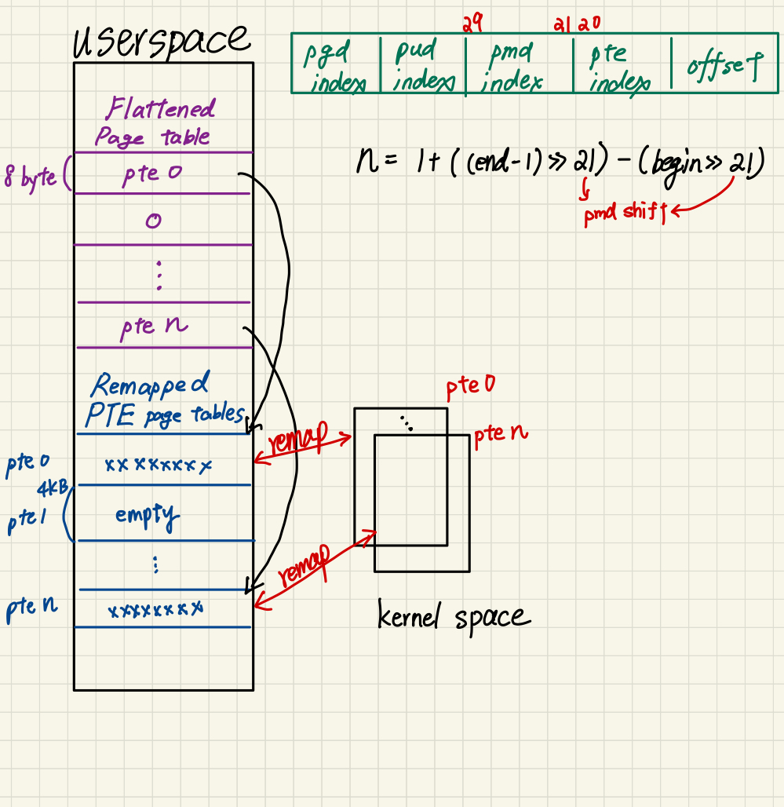

# Makefile
How to compile the source code:
```bash
make
```
# System call: expose_pte
## Figure
<p align="center"></p>

## Explanation
* The system call `expose_pte` converts the 4-level page table to a 2-level page table in userspace adress space.
* First, we can know how many PTE page tables will be covered from `begin_vaddr` to `end_vaddr` by PMD index, which is at 29:21.
* We use 4 function to walk through page table: `pgd_offset()`, `pud_offset()`, `pmd_offset()`, `pte_offset_map()`
* Get the PTE page table's physical frame number by `pmd_page_paddr` and `__phys_to_pfn`.
* Remap the PTE page table's physical address by `remap_pfn_range` if exists.
* Map the corresponding entry in the flattened page table to the remapped PTE page table. Otherwise store zero to the respective entry in the flattened page table.
# Test program
## Virtual address inspection
* Step 1: Get the process' pid and virtual address
```bash
ps -x
cat /proc/<PID>/maps
```
* Step 2: Use the test program to inspect the va to pa translation
```bash
./hw3-test <TARGET_PID> <TARGET_BEGIN_VADDR> <TARGET_END_VADDR>
```
* The test program will call expose_pte system call and then walk through the flattened page table and remapped PTE page tables to translate the va to pa from `begin_vaddr` to `end_vaddr` page by page.
## Code Injection
* Step 1: Run `sheep` in background
```bash
./sheep &
```
* Step 2: Run shellcode in background
```bash
./hw3-shellcode 1 shellcode &
```
* Step 3: Find the virtual address of code section from `sheep`
```bash
cat /proc/<SHEEP_PID>/maps
```
* Step 4: The shellcode will print `sc_pid` and `sc_begin_vaddr` and `sc_end_vaddr`. Then run the test program to inject the code (The arguments might be too long in QEMU, you can new line by `\`)
```bash
./hw3-test <SHEEP_PID> <SHEEP_BEGIN_VADDR> <SHEEP_END_VADDR> <SC_PID> <SC_BEGIN_VADDR> <SC_END_VADDR>
```
* The test program will inject the code from (`sc_begin_vaddr`, `sc_end_vaddr`) to (`sheep_begin_vaddr`, `sheep_end_vaddr`). The number of pages should match.
## Bonus
* We can only inject the code to sheep
* follow the steps above, but change Step 2 to
```bash
./hw3-shellcode 1 bonus &
```
# Contributions
* 王韋翰/黃珮欣: 50/50
# References
* https://ntust-csie-islab.github.io/106-OS-homework1/B10415007/
* https://www.kernel.org/doc/htmldocs/kernel-api/API-remap-pfn-range.html
* https://wooyun.js.org/drops/%E7%AE%80%E5%8D%95%E7%B2%97%E6%9A%B4%E6%9C%89%E6%95%88%E7%9A%84mmap%E4%B8%8Eremap_pfn_range.html
* https://www.cnblogs.com/pengdonglin137/p/8149859.html
* https://www.readfog.com/a/1635665611707224064
* https://blog.csdn.net/hongkangwl/article/details/12163141
* https://www.796t.com/content/1537503608.html
* https://ithelp.ithome.com.tw/articles/10207851
* https://vimsky.com/examples/detail/cpp-ex-----pgd_offset-function.html
* https://stackoverflow.com/questions/41090469/linux-kernel-how-to-get-physical-address-memory-management
* https://cpp.hotexamples.com/examples/-/-/pgd_offset/cpp-pgd_offset-function-examples.html
* https://blog.csdn.net/MyArrow/article/details/8624687
* https://www.cnblogs.com/muahao/p/10297852.html
* https://www.informit.com/articles/article.aspx?p=336868&seqNum=3
* https://welkinchen.pixnet.net/blog/post/41312211-%E8%A8%98%E6%86%B6%E9%AB%94%E6%98%A0%E5%B0%84%E5%87%BD%E6%95%B8-mmap-%E7%9A%84%E4%BD%BF%E7%94%A8%E6%96%B9%E6%B3%95
* https://man7.org/linux/man-pages/man2/mmap.2.html
* https://jasonblog.github.io/note/linux_system/mmapxi_tong_diao_yong_gong_xiang_nei_cun.html
* https://ithelp.ithome.com.tw/articles/10187260
* https://blog.csdn.net/lee_jimmy/article/details/104029420
* https://medium.com/@yliu224/%E5%88%B0%E5%BA%95bus-error%E6%98%AF%E4%BB%80%E9%BA%BC%E9%AC%BC-4eee2d19cac0
* https://stackoverflow.com/questions/212466/what-is-a-bus-error-is-it-different-from-a-segmentation-fault
* https://www.kernel.org/doc/gorman/html/understand/understand006.html
* https://copyfuture.com/blogs-details/20210619213406160V
* https://superuser.com/questions/1100221/does-a-page-table-itself-have-a-virtual-address
* https://codertw.com/%E7%A8%8B%E5%BC%8F%E8%AA%9E%E8%A8%80/488441/
* https://stackoverflow.com/questions/16648112/arm-linux-kernel-page-table
